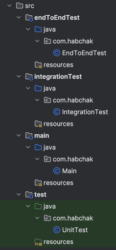

# How to set up different types of tests using Gradle and TestSets plugin

This way is very short and simple.

Add the plugin to your `build.gradle` file:

```groovy
plugins {
    id 'org.unbroken-dome.test-sets' version '4.1.0'
}
```

Specify the new test sets:

```groovy
testSets {
    integrationTest
    functionalTest
}
```

You don't need to include the `test` to sets because it set up by default.

Create a new folder in `src` to add your tests there.
    .
    ├── ...
    ├── src
    │   └── integrationTest
    │       └── com.habchak
    │           └── YourFunctionalTest.java
    └── ...

It's a good idea to add the `test` task to the `check` task:

```groovy
tasks.named('check') {
    dependsOn integrationTest
    dependsOn endToEndTest
}
```

You can specify dependencies for each test set:

```groovy
dependencies {
    testImplementation('org.springframework.boot:spring-boot-starter-test') {
        exclude group: 'org.springframework.boot', module: 'spring-boot-test' //exclude from unit tests
    }
    integrationTestImplementation 'org.springframework.boot:spring-boot-starter-test'
    endToEndTestImplementation 'org.springframework.boot:spring-boot-starter-test'
}
```

Advantages:
- Short and simple.

Disadvantages:
- Intellij IDEA doesn't display new test sets as tests just as modules.

